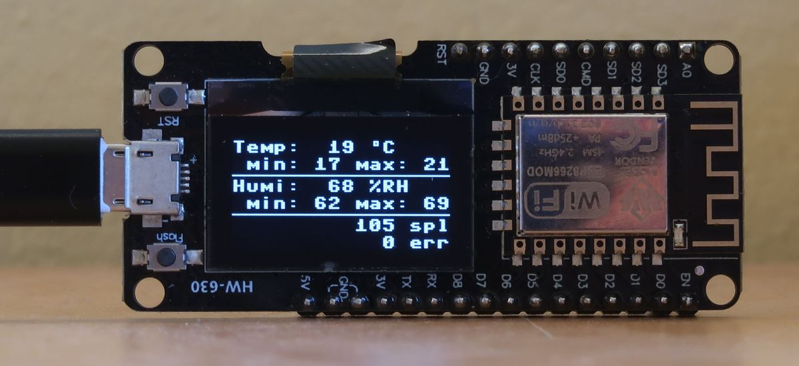

# Temperature & Humidity Monitor

Damn simple application implemented in MicroPython, dedicated for ESP8266 platforms.



## Hardware Configuration

```
         ----------------               ------------
        | D-duino     3V |-------------| VCC        |
  USB --|    v3      GND |-------------| GND  DHT11 |
(Power) | (HW-630)    D0 |--|4k7 ohm|--| Data       |
         ----------------               ------------
```

## Software Configuration

```sh
pip install esptool
pip install adafruit-ampy
esptool.py --port /dev/ttyUSB0 erase_flash
esptool.py --port /dev/ttyUSB0 --baud 115200 write_flash --flash_size=4MB -fm dio 0 ESP8266_GENERIC-20231005-v1.21.0.bin
ampy -p /dev/ttyUSB0 -b 115200 put  mpy-temp-humi.py main.py
```

MicroPython firmware is available [here](https://micropython.org/download/ESP8266_GENERIC/).


