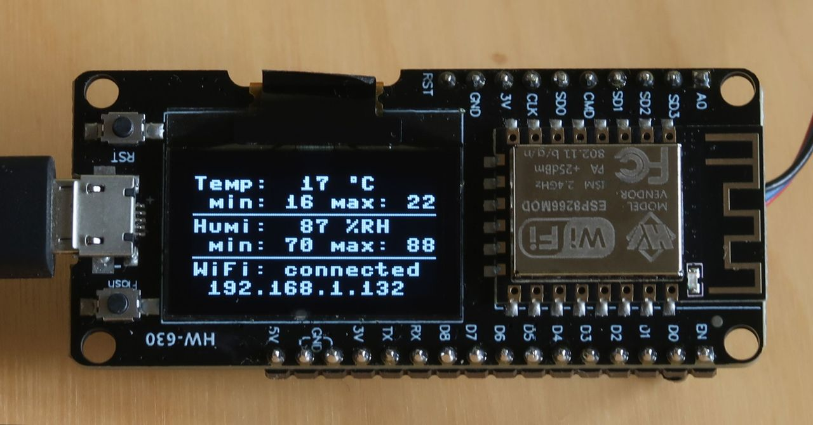
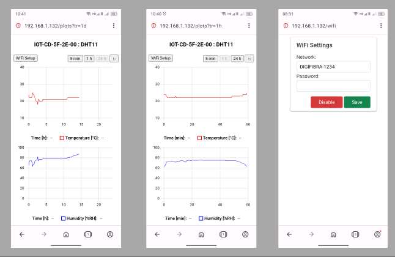
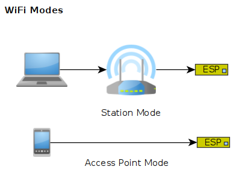

# Temperature & Humidity Monitor

Damn simple application implemented in MicroPython, dedicated for ESP8266 platforms.

`master` branch supports DHT11 sensor. `dht22` branch supports DHT22.

<p align="center">

</p>

<p align="center">

</p>

## Features

- Measures humidity & temperature
- Provides current, max & min readings on the display
- Provides historical readings in form of a graph
- Doesn't need internet connection
- Three time range configurations: 5 min, 1 h, 24 h
- Three display modes: light, dark, night
- Three WiFi modes: disabled, access-point, station

<p align="center">

</p>

## Usage

Press RESET button to reset device. Press DISP button to switch display mode.

By default device starts in access-point WiFi mode. In this mode, you can connect your computer/smartfon directly to ESP8266. Follow instructions on the screen.

In order to disable WiFi, or switch to station mode, open your web browser and select WiFi Setup. Provide SSID and password. After reset, ESP8266 will connect to your switch/router. It will be accessible under IP displayed on the screen.

Hold DISP button any time to reset WiFi settings.

## Design Decisions

- Frontend has been built using minimalistic libraries ([chota](https://jenil.github.io/chota/), [uplot](https://github.com/leeoniya/uPlot)) in order to fit it into persistent memory and be served efficiently.
- In order to save resources in ESP8266, frontend has been built as a set of static HTML files and is rendered entirely on the client side.
- Final source code is compiled to .mpy files to boost startup time and to save memory.
- Data type optimizations (`array`, `const`) and Python generators have been employed to save memory in ESP8266.
- Viper code and Native code emiters didn't bring much benefits and havn't been used in this application.
- Dedicated web framework (*mlask*) has been developed to meet aforementioned criteria.

## Hardware Configuration

```
         ----------------                   ------------
        |            GND |-----------------| GND        |
        | D-duino    3V3 |--------------+--| VCC        |
  USB --|    v3          |              |  |      DHT11 |
(Power) | (HW-630)       |  +-|4k7 ohm|-+  |            |
        |                |  |              |            |
        |             D0 |--+--------------| Data       |
         ----------------                   ------------
```

## Software Deployment


1. Prepare environment

```sh
# install utilities
pip install esptool adafruit-ampy cada
# erase entire memory
esptool.py --port /dev/ttyUSB0 erase_flash
# upload MicroPython
esptool.py --port /dev/ttyUSB0 --baud 115200 write_flash --flash_size=4MB -fm dio 0 ESP8266_GENERIC-20231005-v1.21.0.bin
```

MicroPython firmware is available [here](https://micropython.org/download/ESP8266_GENERIC/).

2. Upload files
```sh
# compile sources
cada 'mpy-cross src/*.py'

# upload files
cada 'ampy -p /dev/ttyUSB0 put src/*.mpy'
ampy -p /dev/ttyUSB0 put src/main.py
cada 'ampy -p /dev/ttyUSB0 put static/*'
```

3. Troubleshooting

- Try changing bound rate to 19200 in case of problems with `esptool.py`.

- Press reset button before invoking `ampy put`. Possibly active timer interrupt may corrupt uploading process.

- In case of any runtime problems, check stdout with:
```sh
mpremote
```

## TODO

- Auto-refresh dashboard
